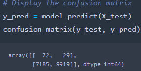
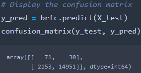

# Amazon_Vine_Analysis

## Overview of the Analysis
### Purpose
The purpose of this analysis is to evaluate the performance of the following models: RandomOverSampler, SMOTE, ClusterCentroids, SMOTEENN, BalancedRandomForestClassifier, and EasyEnsembleClassifier.

## Results 
### RandomOverSampler Model

 - The balanced accuracy score is 65%.
	 - high_risk
		 - The precision is 1%
		 - The recall score is 71%
	- low_risk
		 - The precision is 100%
		 - The recall score is 58%

### SMOTE Model
 - The balanced accuracy score is 66%.
	 - high_risk
		 - The precision is 1%
		 - The recall score is 63%
	- low_risk
		 - The precision is 100%
		 - The recall score is 69%

### ClusterCentroids Model
 - The balanced accuracy score is 54%.
	 - high_risk
		 - The precision is 1%
		 - The recall score is 69%
	- low_risk
		 - The precision is 100%
		 - The recall score is 40%
	

### SMOTEENN Model
 - The balanced accuracy score is 64%.
	 - high_risk
		 - The precision is 1%
		 - The recall score is 68%
	- low_risk
		 - The precision is 100%
		 - The recall score is 59%

### BalancedRandomForestClassifier Model
 - The balanced accuracy score is 79%.
	 - high_risk
		 - The precision is 3%
		 - The recall score is 70%
	- low_risk
		 - The precision is 100%
		 - The recall score is 87%

### EasyEnsembleClassifier Model
 - The balanced accuracy score is 93%.
	 - high_risk
		 - The precision is 9%
		 - The recall score is 92%
	- low_risk
		 - The precision is 100%
		 - The recall score is 94%

## Summary
Based on the results, the best model to use is the EasyEnsembleClassifier model. This model has the highest balanced accuracy score and the highest recall scores for both high risk and low risk credit. However, just because this model is the best of the evaluated models, it doesn't mean this one should be used, In fact, I believe none of these models should be used because even the best model still misidentifies many credits as high when in fact they are low risk.
